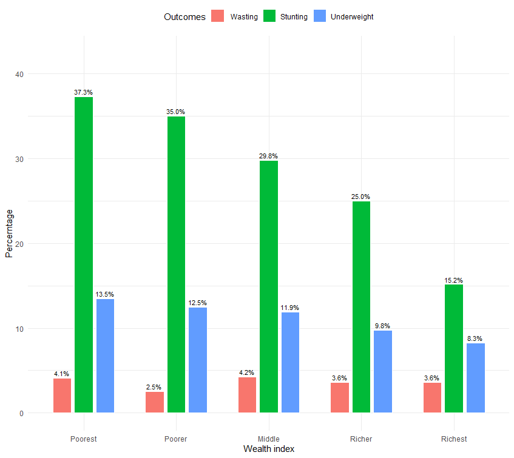
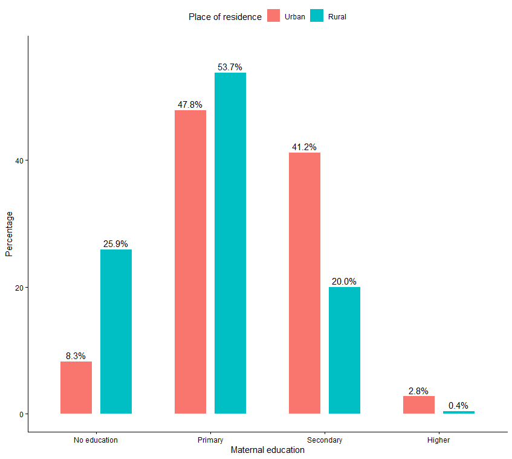
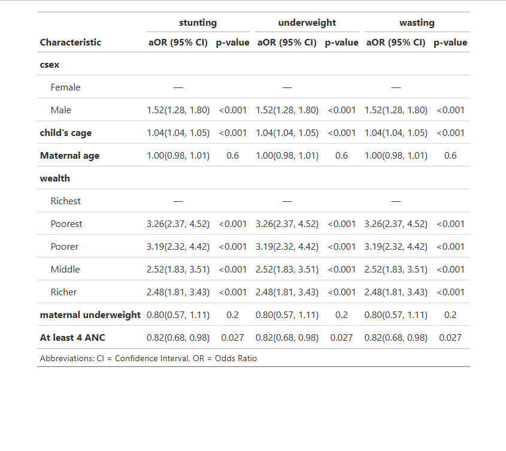

# 🇹🇿 Determinants of Childhood Malnutrition in Tanzania (DHS 2022)
  

> **Project Abstract:** Using data from the **2022 Tanzania Demographic and Health Survey (TDHS)**, this study investigates the socio-economic drivers of childhood stunting, underweight, and wasting. The analysis applies **survey-weighted logistic regression** to identify vulnerable populations among children under five.

---

## 📊 1. Key Findings: The Wealth Gradient
*The prevalence of malnutrition is starkly stratified by household wealth.*

<p align="center">
  
  <br>
  <em>Figure 1: Prevalence of Stunting (Green), Wasting (Red), and Underweight (Blue) by Wealth Index.</em>
</p>

### 🧐 Epidemiological Insight
> **The Poverty Penalty:**
> * **Stunting:** Children from the **Poorest** households have a **37.3%** prevalence of stunting, compared to only **15.2%** in the Richest households.
> * **Gradient Effect:** There is a clear dose-response relationship; as wealth increases, malnutrition outcomes linearly decrease.

---

## 🌍 2. Demographic Disparities (Urban vs. Rural)
*Comparing maternal education levels across residential settings.*

<p align="center">
  
  <br>
  <em>Figure 2: Distribution of Maternal Education by Residence (Urban vs. Rural).</em>
</p>

> **Observation:**
> * **Educational Gap:** In rural areas (Teal), **25.9%** of mothers have no formal education, compared to only **8.3%** in urban areas.
> * **Impact:** Maternal education is a known protective factor against child malnutrition; this disparity likely contributes to the higher stunting rates observed in rural Tanzania (31.65%) vs. Urban (21.55%).

---

## 📈 3. Multivariate Analysis (Adjusted Odds Ratios)
*Identifying significant risk factors while controlling for confounders.*

<p align="center">
  
  <br>
  <em>Table 1: Multivariable Logistic Regression Models for Stunting, Underweight, and Wasting (Adjusted Odds Ratios).</em>
</p>

### 📝 Clinical Interpretation
The weighted logistic regression model reveals three critical determinants:
1.  **Male Vulnerability:** Male children have significantly higher odds of all three malnutrition outcomes compared to females (**aOR for Stunting: 1.52**, 95% CI: 1.28–1.80).
2.  **Socio-economic Status:** Being in the "Poorest" wealth quintile triples the odds of stunting (**aOR: 3.26**) compared to the "Richest" reference group.
3.  **Protective Care:** Mothers who attended **At least 4 Antenatal Care (ANC)** visits had significantly lower odds of having a stunted child (**aOR: 0.82**, p=0.027).

---

## 🛠️ Methodology
This analysis accounts for the complex survey design of the DHS to generate nationally representative estimates.

* **Tools Used:** `R` (tidyverse, survey, haven, ggplot2).
* **Survey Design:**
    * **Weights:** De-normalized individual weights (`v005`/1,000,000).
    * **Clustering:** Adjusted for Primary Sampling Units (`v021`).
    * **Stratification:** Adjusted for Region/Urban-Rural strata (`v022`).

```r
# Example of Survey Design Implementation in R
dhs_design <- svydesign(
  id = ~v021,
  strata = ~v022,
  weights = ~sample_weight,
  data = tanzania_data
)

# Weighted Logistic Regression
model <- svyglm(stunting ~ wealth_index + child_sex + maternal_education, 
                design = dhs_design, 
                family = binomial)
